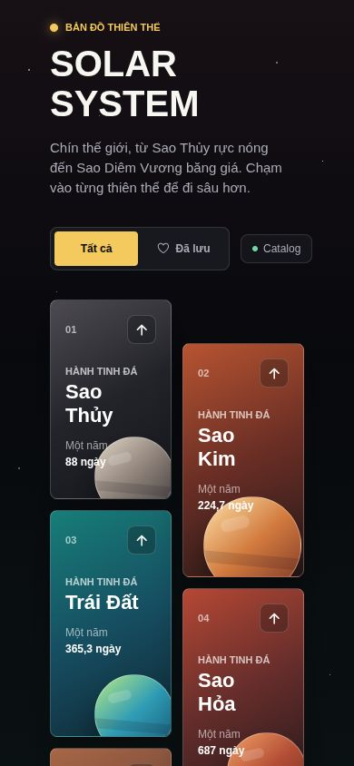
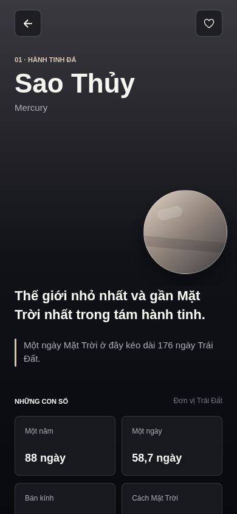

# Solar System

Solar System is an Expo SDK 57 React Native app for exploring the Solar System through a polished mobile-first interface. The app shows nine celestial worlds in an asymmetric grid, opens a dedicated detail screen for each body, keeps a local-first curated catalog, optionally synchronizes metrics from an API, and persists favorite planets on device.

## Screenshots

| Home | Planet Detail |
| --- | --- |
|  |  |

## App Screens

### Home

The Home screen is the main discovery surface. It renders the curated Solar System catalog in a two-column asymmetric grid, gives each planet its own gradient theme, and lets users switch between all planets and saved favorites.

Key behavior:

- Displays Mercury, Venus, Earth, Mars, Jupiter, Saturn, Uranus, Neptune, and Pluto.
- Presents Pluto as a dwarf planet while still treating it as the ninth explored world.
- Shows each planet's order, category, year length, and gradient visual.
- Uses pull-to-refresh to trigger TanStack Query refetching when a remote API is configured.
- Shows a fallback catalog status when the app is using local curated data.

### Planet Detail

The Planet Detail screen focuses on one selected body. It is opened through Expo Router at `/planet/[id]` and receives the planet id from the route params.

Key behavior:

- Shows the localized planet name, English name, category, visual theme, and signature fact.
- Displays metrics for year length, day length, radius, distance from the Sun, gravity, temperature, moons, and rings.
- Lets users save or remove a planet from favorites.
- Handles invalid route params with a not-found state.
- Supports Android back navigation by returning to Home when there is no previous route.

## Architecture

The app follows a feature-first structure with thin route files and typed boundaries between navigation, server state, client state, services, and UI.

```text
src/
  app/                         Expo Router routes
    _layout.tsx                Root providers and stack configuration
    index.tsx                  Home route
    planet/[id].tsx            Planet detail route
  components/                  Shared, domain-agnostic UI and layout primitives
  constants/                   Shared design tokens
  features/
    solar-system/              Solar System feature module
      components/              Planet-specific UI components
      data/                    Curated local planet catalog
      hooks/                   TanStack Query hooks and query keys
      screens/                 Feature screen implementations
      services/                API and DTO validation layer
      store/                   Zustand client state
      types.ts                 Domain types and type guards
      utils/                   Formatting helpers
  lib/
    http/                      Shared HTTP client helpers
  providers/                   App-wide runtime providers
```

### Navigation

Expo Router owns routing, deep links, route params, and screen composition. Route files in `src/app` stay intentionally small: they read params where needed and render the owning feature screen.

### Server State

TanStack Query owns server state and request lifecycle. `usePlanetsQuery` exposes the catalog query with curated local `initialData`, so the UI can render immediately even when no API endpoint is configured.

When `EXPO_PUBLIC_SOLAR_API_URL` is set, the app requests `GET /bodies`, validates the response with Zod, maps remote DTO fields into the local `Planet` domain model, and keeps curated values as fallbacks.

### Client State

Zustand owns mutable client state that is shared across screens. Today that state is the user's favorite planet ids. The store persists only non-sensitive preferences through AsyncStorage.

### Providers

`src/providers/AppProviders.tsx` creates one stable `QueryClient`, wires native app focus into TanStack Query, connects `expo-network` to Query's online manager, and wraps the app with gesture, safe-area, and query providers.

## Run Locally

Use Node.js `22.13.x` or newer.

```bash
npm install
npm start
```

Open the app with Expo Go, an Android emulator, an iOS simulator, or the web target.

```bash
npm run android
npm run ios
npm run web
```

If a physical Android device stays on the Expo Go loading screen, use the tunnel workflow:

```bash
npm run start:tunnel
npm run android:device
```

More details: [docs/09-chay-android-device.md](docs/09-chay-android-device.md).

## Build

Create production Expo bundles for Android, iOS, and web:

```bash
npx expo export --platform all --clear
```

The export output is written to `dist/`. That directory is ignored by git because it is a generated build artifact.

## Quality Checks

Run these before pushing changes:

```bash
npm run lint
npx tsc --noEmit
npx expo-doctor
```

## Environment

The app works without a remote API because it ships with a curated catalog. To sync from an API-compatible service, configure:

```bash
EXPO_PUBLIC_SOLAR_API_URL=https://api.example.com
```

Do not put secrets in `EXPO_PUBLIC_*` variables. Expo embeds those values into the client bundle.

## Developer Documentation

Vietnamese engineering documentation lives in [docs/README.md](docs/README.md). Start there before changing architecture, state ownership, API contracts, navigation, feature boundaries, or UI component placement.

## Assets

Planet PNG assets are expected under `assets/images/planets/` when they are provided. Until then, the app uses native gradient-based planet visuals so the experience remains complete without external images.
